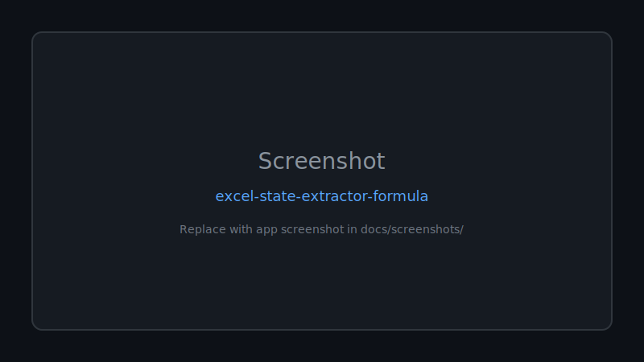
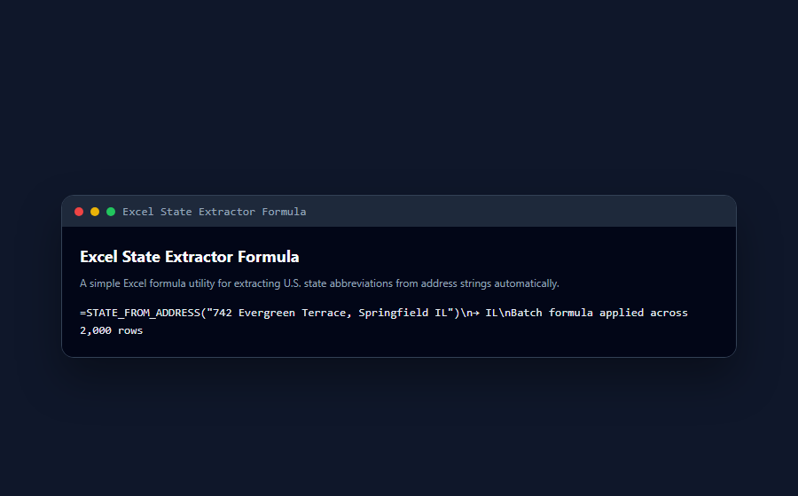

<div align="center">

# 🚀 Excel State Extractor Formula

**A simple Excel formula utility for extracting U.S. state abbreviations from address strings automatically.**

Documented · MIT licensed · Maintained

[](LICENSE)
[](CONTRIBUTING.md)

[Features](#-features) · [Quick Start](#-quick-start) · [Screenshots](#-screenshots) · [Contributing](CONTRIBUTING.md)

</div>

---

## 🖼 Screenshots



*Replace `docs/screenshots/placeholder.svg` with real app screenshots.*

---

## 🐍 Contribution graph


<picture>
  <source media="(prefers-color-scheme: dark)" srcset="https://raw.githubusercontent.com/mafzalkalwardev/excel-state-extractor-formula/output/snake-dark.svg" />
  <source media="(prefers-color-scheme: light)" srcset="https://raw.githubusercontent.com/mafzalkalwardev/excel-state-extractor-formula/output/snake.svg" />
  
</picture>


---

\# Excel State Extractor Formula


A simple Excel formula utility for extracting U.S. state abbreviations from address strings automatically.


Useful for:

\- Dispatch workflows

\- Excel automation

\- Address data cleaning

\- CRM spreadsheets

\- Lead processing


\## Formula


```excel

=MID(A1, FIND(",", A1) + 1, 2)

```


\## Example


\### Input


```text

123 Main Street, TX

```


\### Output


```text

TX

```


\## Use Cases


\- Extracting states from addresses

\- Cleaning lead databases

\- Dispatch software workflows

\- Excel automation tasks

\- Data preprocessing


\## Project Structure


```text

excel-state-extractor-formula/

│

├── formula.txt

├── README.md

└── .gitignore

```


\## Author


Muhammad Afzal Kalwar


GitHub:

@mafzalkalwardev

## Screenshots



